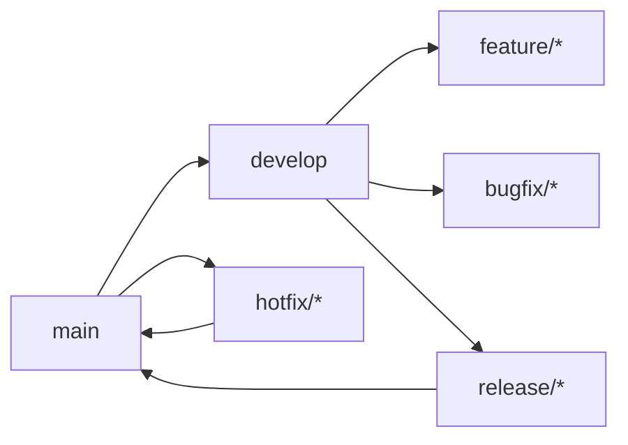

# Blue Archive Sensei no Enjo

A comprehensive fan-made tool for the **Blue Archive** community, providing an interactive and performant interface for exploring student data, building teams, and managing resources.

## ✨ Features

- **Student Database**: Complete student roster with detailed character information
- **Interactive Search**: Filter students by name and school with real-time results
- **Character Details**: Comprehensive student profiles with stats, skills, and artwork
- **Responsive Design**: Optimized for both desktop and mobile experiences
- **Fast Performance**: Built with modern web technologies for lightning-fast loading
- **Type-Safe**: Full TypeScript implementation for reliability and maintainability

## 🚀 Tech Stack

- **Frontend Framework**: React 18 with TypeScript
- **Build Tool**: Vite (ultra-fast development and optimized production builds)
- **Styling**: CSS with responsive design principles
- **Data Source**: [SchaleDB](https://schale.gg/) API integration
- **Code Quality**: ESLint with React-specific rules

## 🛠️ Quick Start

### Prerequisites

- Node.js (v18 or higher)
- npm or yarn

### Installation

```bash
# Clone the repository
git clone https://github.com/your-username/blue-archive-sensei-no-enjo.git
cd blue-archive-sensei-no-enjo

# Install dependencies
npm install

# Start the development server
npm run dev
```

The application will be available at `http://localhost:5173`

### Available Scripts

- `npm run dev` - Start development server with hot reload
- `npm run build` - Build for production
- `npm run preview` - Preview production build locally
- `npm run lint` - Run ESLint for code quality checks
- `npm run update-data` - Update student data from SchaleDB API

## 📁 Project Structure

```
src/
├── components/          # Reusable UI components
│   ├── StudentList.tsx  # Main student grid component
│   ├── CharacterDetails.tsx  # Student detail sidebar
│   └── *.css            # Component stylesheets
├── data/               # Data management and types
│   └── students.ts     # Student data fetching utilities
├── assets/             # Static assets (images, icons)
├── App.tsx             # Main application component
└── main.tsx            # Application entry point

public/data/            # Static data files
scripts/                # Data update scripts
docs/                   # Documentation
```

## 🎯 Development Guidelines

### Code Standards

- **TypeScript**: Strict mode enabled, no `any` types allowed
- **React**: Functional components with TypeScript interfaces
- **Styling**: Component-scoped CSS with kebab-case class names
- **Commits**: Follow [Conventional Commits](https://www.conventionalcommits.org/) format

### Architecture Principles

- **Feature-First Organization**: Code organized by domain/feature rather than file type
- **Single Source of Truth**: Student data managed centrally through SchaleDB integration
- **Performance Focused**: Lazy loading, virtualization, and optimized assets
- **Community Driven**: Clean, documented code for easy contributions

### Data Management

Student data is fetched from SchaleDB and cached locally. The data includes:
- Basic student information (name, school, role)
- Detailed stats and skills
- Character artwork and portraits
- Equipment and weapon data

## 🌿 Development Workflow

We follow a **Git Flow** branching strategy to maintain a clean and organized codebase:

### Branch Structure

| Branch | Purpose |
|--------|---------|
| `main` | Production-ready code. Always stable and deployable. |
| `develop` | Integration branch for features. Contains the latest development changes. |
| `feature/*` | New features (e.g., `feature/team-builder-ui`, `feature/student-search`) |
| `bugfix/*` | Bug fixes (e.g., `bugfix/stats-calculation`) |
| `hotfix/*` | Critical production fixes (e.g., `hotfix/login-crash`) |
| `release/*` | Release preparation (e.g., `release/v1.2.0`) |

### Workflow



**Development Flow:**
1. Create feature branches from `develop`
2. Merge features back to `develop` when complete
3. Create release branches from `develop` for production releases
4. Merge releases to both `develop` and `main`

**Best Practices:**
- Never commit directly to `main`
- Keep feature branches short-lived
- Use descriptive branch names
- Delete branches after merging

## 🤝 Contributing

We welcome contributions! Please see our [Contributing Guidelines](CONTRIBUTING.md) for details.

1. Fork the repository
2. Create a feature branch: `git checkout -b feature/amazing-feature`
3. Make your changes following our [Coding Guidelines](docs/CODING_GUIDELINES.md)
4. Commit using conventional commits: `git commit -m 'feat: add amazing feature'`
5. Push to the branch: `git push origin feature/amazing-feature`
6. Open a Pull Request

### Development Setup

```bash
# Install dependencies
npm install

# Run linting
npm run lint

# Build for production
npm run build

# Update student data
npm run update-data
```

## 📚 Documentation

- [Architecture Overview](docs/ARCHITECTURE.md) - Technical architecture and design decisions
- [Coding Guidelines](docs/CODING_GUIDELINES.md) - Code standards and best practices

## 🔗 Links

- **Blue Archive Official**: [Official Website](https://bluearchive.jp/)
- **SchaleDB**: [Database Source](https://schale.gg/)
- **Community**: [Blue Archive Subreddit](https://reddit.com/r/BlueArchive/)

## 📄 License

This project is a fan-made tool and is not officially affiliated with Blue Archive or Nexon. All student data and images belong to their respective owners.

---

**Built with ❤️ for the Blue Archive community**
